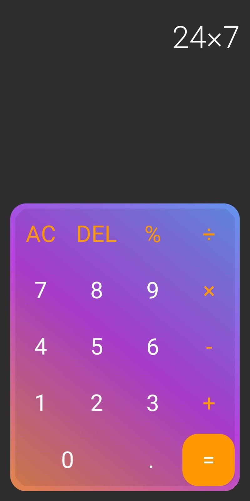

# Basic Calculator App

This is a user-friendly calculator app for simple arithmetic operations, featuring essential functions like addition, subtraction, multiplication, and division. Perfect for quick and accurate calculations on the go.

## Tech Stack

- **Kotlin**: For Android application development.
- **Jetpack Compose**: To create modern, declarative UI components.
- **Android Studio**: Development environment.

## Installation and Usage

1. Clone the repository to your local machine:  
   ```
   git clone https://github.com/your-username/basic-calculator-app.git
   ```

2. Open the project in Android Studio.

3. Sync the Gradle files and let all dependencies download.

4. Connect your Android device or start an emulator.

5. Click on "Run" to build and launch the app.

## Usage Instructions

1. Launch the Basic Calculator App on your Android device.

2. Enter the numbers and select the operation (addition, subtraction, multiplication, division, percentage calculation).

3. The result will be instantly displayed as you perform calculations.

4. Click on "AC" to reset and start a new calculation.

## Screenshots



## GitHub

You can find me on [GitHub](https://github.com/sayan0328).
