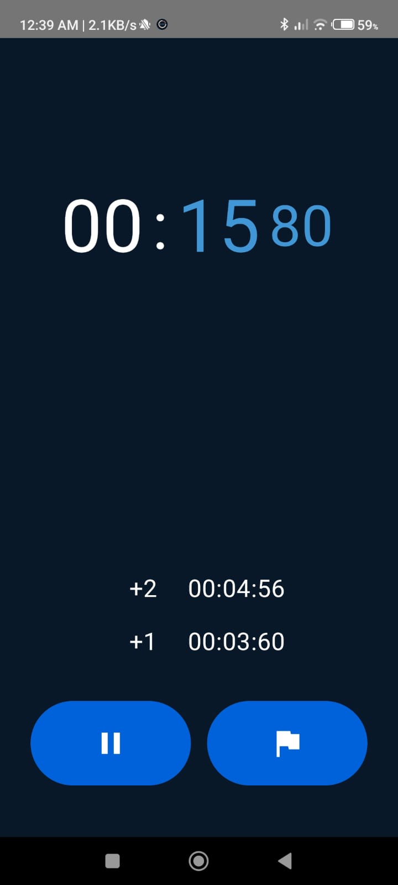

# Stopwatch App

This Stopwatch App is a sleek and user-friendly tool for accurate time tracking with easy start/stop functionality and time logging. Ideal for workouts, cooking, studying, and more.

## Tech Stack

- **Kotlin**: For Android application development.
- **Jetpack Compose**: To create modern, declarative UI components.
- **Dagger Hilt**: For dependency injection, facilitating a modular and testable codebase.
- **Android Studio**: Development environment.

## Installation and Usage

1. Clone the repository to your local machine:  
   ```
   git clone https://github.com/your-username/stopwatch-app.git
   ```

2. Open the project in Android Studio.

3. Sync the Gradle files and let all dependencies download.

4. Connect your Android device or start an emulator.

5. Click on "Run" to build and launch the app.

## Usage Instructions

1. Launch the Stopwatch App on your Android device.

2. Tap Start to begin timing.

3. Tap Stop to pause the timer.

4. Tap Reset to clear the time and start over.

5. The app tracks and displays the elapsed time in minutes, seconds, and milliseconds.

## Screenshots



## GitHub

You can find me on [GitHub](https://github.com/sayan0328).