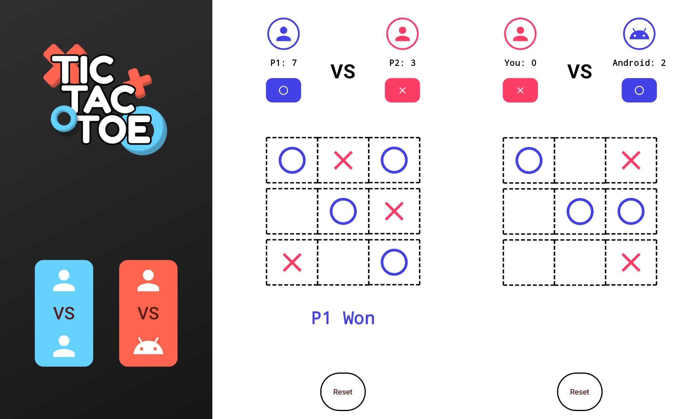

# Tic Tac Toe Game
  Play the classic game of Tic Tac Toe with a sleek, user-friendly interface, featuring both single and two-player modes. Challenge friends or the AI and enjoy endless fun!

## Tech Stack

- **Kotlin**: For Android application development.
- **Jetpack Compose**: To create modern, declarative UI components.
- **ViewModel**: For managing the app’s state and lifecycle efficiently.
- **NavController**: For smooth navigation between game screens.
- **Android Studio**: Development environment.

## Installation and Usage

1. Clone the repository to your local machine:  
   ```
   git clone https://github.com/your-username/tic-tac-toe-game.git
   ```

2. Open the project in Android Studio.

3. Sync the Gradle files and let all dependencies download.

4. Connect your Android device or start an emulator.

5. Click on "Run" to build and launch the app.

## Usage Instructions

1. Launch the Tic Tac Toe App on your Android device.

2. Choose to play either play against another player or a bot.

3. The app will automatically detect a win, loss, or draw, and update the scores.

4. Press the Reset button to start a new game.

## Screenshots



## GitHub

You can find me on [GitHub](https://github.com/sayan0328).